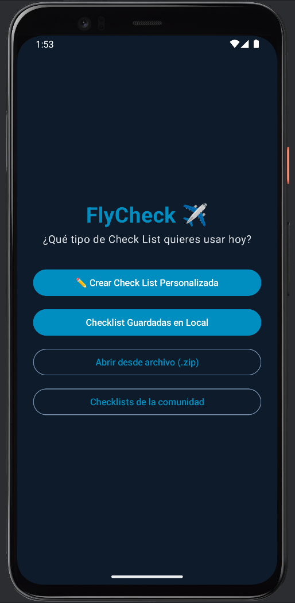
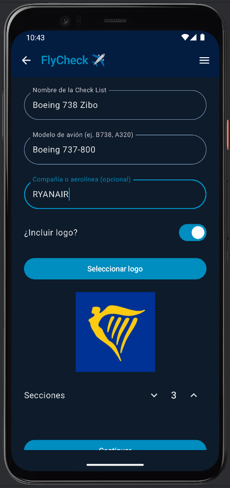
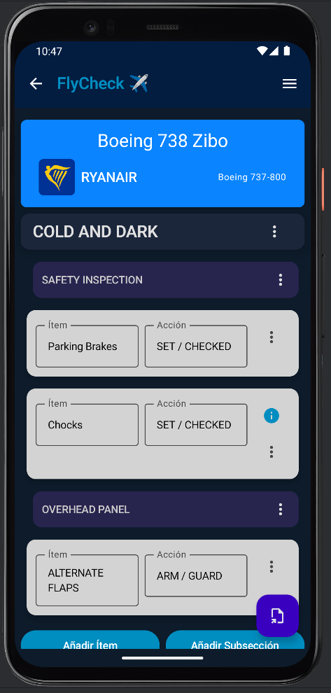
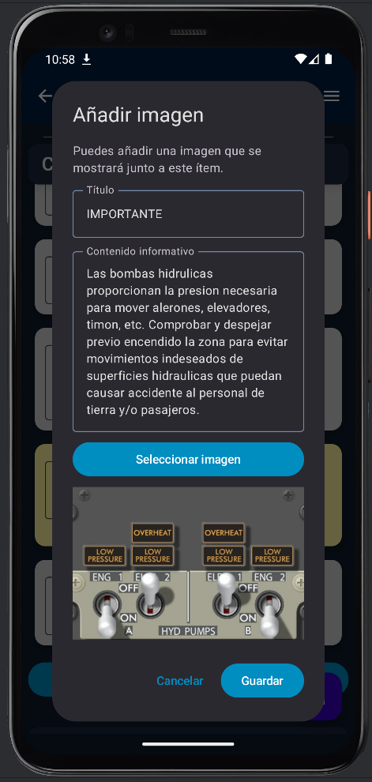
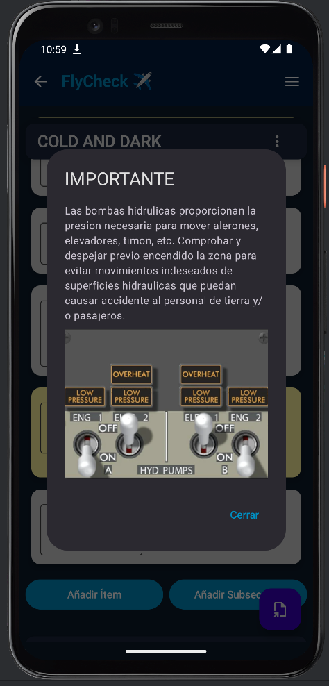
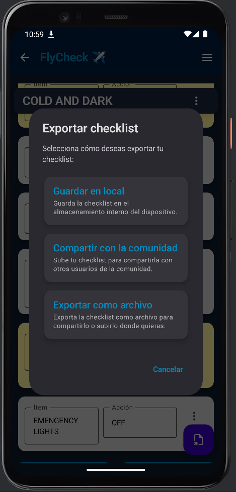
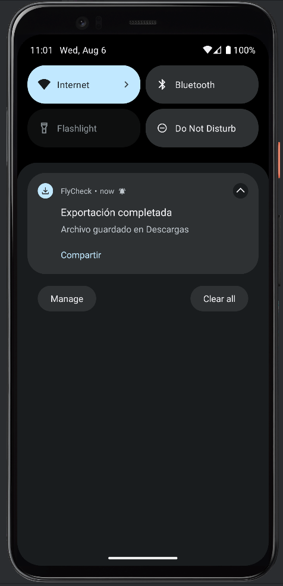
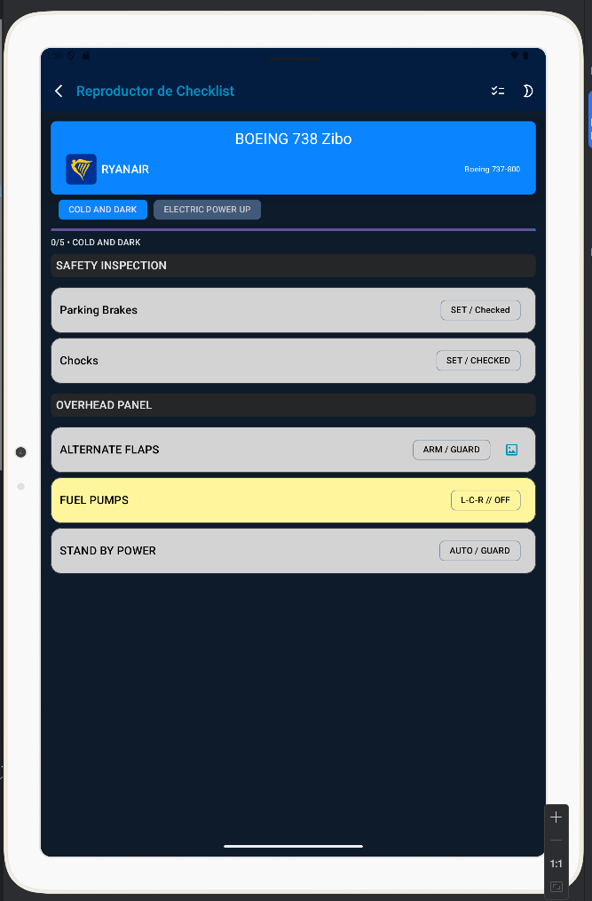

# 🛫 FlyCheck — App de Listas de Verificación para Aviación y Simulación Aérea

**FlyCheck** es una aplicación Android nativa (Kotlin + **Jetpack Compose**) para **crear, gestionar y ejecutar** *checklists* específicas de aviones y aerolíneas.

Pensada para entornos aeronáuticos (pilotos virtuales, simulación o incluso formación real), permite documentar procedimientos con imágenes, instrucciones y secciones personalizadas, y reproducirlas de forma clara durante el vuelo.

> 🎯 Proyecto de porfolio con vistas a publicación en Google Play.

---

---
**VERSIÓN PÚBLICA/ PORTFOLIO** se continará el desarrollo en privado.

---

## ✨ Características principales

### 🧩 Editor de plantillas (Checklist Builder)
- Secciones, subsecciones e ítems con estructura libre.
- 🖼️ Imagen por ítem (galería/cámara) para localizar elementos de cabina.
- 🧠 Campo de información técnica por ítem (texto de apoyo).
- 🎨 Colores de énfasis por ítem.
- 💾 Exportación a `.zip` (incluye `checklist.json` + carpeta `/images`).
- 📤 Compartir directamente o guardar localmente.

### ▶️ Displayer / Reproductor de checklist
- Ejecución paso a paso con **progreso por sección**.
- **Pestañas de secciones** (chips) con estados normal/seleccionado/**completado**.
- **Subsecciones** con cabeceras en lista y **selector rápido** (bottom sheet) para saltar.
- Diálogos de **información** y **imagen** por ítem.
- **Diseño adaptativo**:
  - Móvil apaisado compacto: *header* desplazable + **tabs sticky**.
  - Resto de tamaños: layout columnar con cabecera, tabs, progreso y lista.
- **Tema** claro/oscuro/sistema con toggle en la TopBar.

### 📁 Manager de checklists locales
- Listado de plantillas guardadas en el dispositivo.
- **Abrir** en el Displayer, **renombrar** y **eliminar**.
- Feedback mediante **Snackbars**.

---

## 🛠️ Tecnologías y librerías

- **Jetpack Compose** (Material 3 / Material You)
- **Kotlin Coroutines & StateFlow**
- **Hilt** (DI)
- **Navigation Compose**
- **kotlinx.serialization** (JSON)
- **MediaStore / FileProvider**
- **NotificationManager**

---

## 📦 Estructura de exportación

Cuando se exporta una plantilla, se genera un `.zip` con esta estructura:

📁 checklist_Boeing738.zip
├── checklist.json
└── images/
├── item_1.jpg
├── item_2.jpg
└── ...

---

## 📸 Capturas de pantalla

  
  
  
  
  
  
  
  

---

## 🧠 Arquitectura (resumen) & rendimiento

- **MVVM + Compose-first**: la UI es declarativa y consume un `DisplayerUiState` como única fuente de verdad.
- **Derivación de estado** en el ViewModel (no en la UI): resúmenes por sección y subsección con datos del modelo aplanado.
- **Pre-indexado** de secciones/subsecciones (\*SectionIndex\*): acelera cómputos contando `DONE` sobre arrays de índices ya filtrados.
- **Trabajo pesado off-main** (`Dispatchers.Default`) y `distinctUntilChanged` para reducir recomposiciones.
- **Eventos efímeros** (`UiEvent`) para Snackbars (errores al parsear JSON, etc.).
- **Robustez**: clamps defensivos (`progress` en `[0,1]`, `done ≤ total`), manejo de checklist vacía y validación de saltos.

---

## ▶️ Cómo ejecutar el proyecto

1. Clona el repositorio y ábrelo con **Android Studio** (JDK 17 recomendado).
2. Sincroniza Gradle.
3. Ejecuta en un dispositivo/emulador **API 24+**.

---

## 🚀 Proyección a futuro

- ☁️ Sincronización en la nube (Firebase o backend propio).
- 🌐 Repositorio comunitario de plantillas (compartición online).
- 🛫 Base de datos offline integrada.
- 🧩 Nuevos tipos de bloques (checkboxes dinámicos, temporizadores, etc.).
- 📲 Publicación oficial en **Google Play**.

---

## 👨‍💻 Sobre el desarrollador

Desarrollado por **Sergio M.**  
📍 España  
🎓 Titulación como Técnico Superior en Desarrollo de Aplicaciones Multiplataforma (DAM).  
📱 Apasionado del desarrollo Android, Jetpack Compose y UI/UX. (Además de la simulación aérea 😜)

---

🔒 **Derechos reservados**

El contenido de este repositorio está protegido por derechos de autor y es propiedad exclusiva de Sergio M. No se permite el uso, modificación, redistribución ni comercialización del código sin autorización previa por escrito.

Este proyecto está destinado únicamente a fines demostrativos en el contexto de un porfolio profesional.

---

## 🤝 ¿Quieres colaborar?

- ¿Te gusta el proyecto? ¡Dale una estrella en GitHub!
- ¿Tienes ideas o sugerencias? Abre un *issue* o *pull request*.
- ¿Eres piloto o estudiante? ¡Contáctame para probar futuras versiones beta!

> 💬 *FlyCheck es más que una app: una herramienta hecha con pasión por la aviación y el desarrollo Android.*
